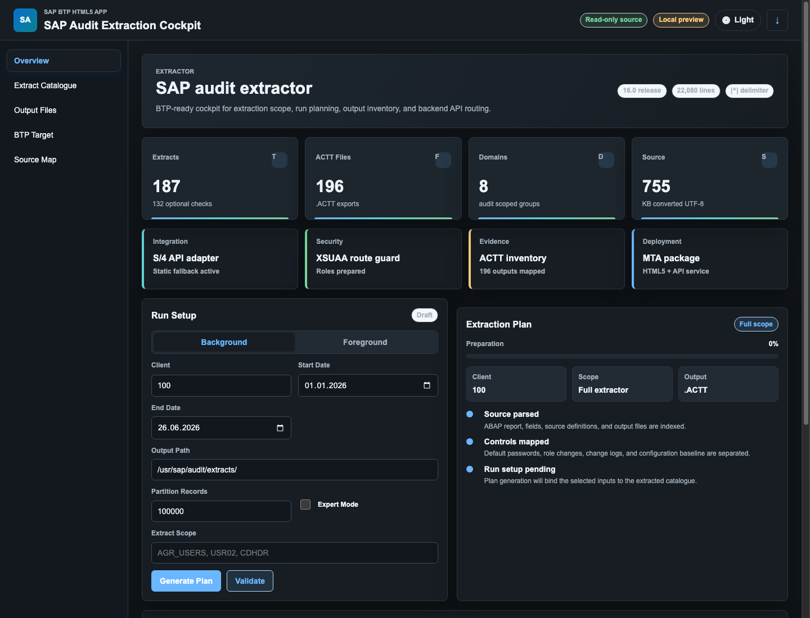

# SAP Audit Extraction Cockpit on SAP BTP

Audit extraction workflows need more than a run screen.

They need clear scope, controlled backend access, traceable outputs, and an interface that makes the process easier to operate.



This is the idea behind SAP Audit Extraction Cockpit: a SAP BTP-ready HTML5 application for planning audit extractions, reviewing extraction scope, visualizing `.ACTT` outputs, and routing S/4HANA access through a controlled API layer.

## What the Cockpit Does

The cockpit brings the key parts of an audit extraction workflow into one interface:

- extraction run setup
- client and date range selection
- background or foreground processing mode
- expert scope selection
- audit domain overview
- extraction source catalogue
- `.ACTT` output inventory
- S/4HANA API routing design
- BTP deployment structure

The goal is to make audit extraction planning easier to understand, easier to govern, and easier to connect to a cloud-native SAP landscape.

## User Experience

The dark preview shows the main operating view:

- summary cards for extraction scope, output inventory, audit domains, and source coverage
- run setup controls for client, date range, output path, partition size, and expert mode
- extraction plan status showing preparation progress and selected output type
- dedicated navigation for catalogue, output files, BTP target configuration, and source mapping

The interface is designed as an operations cockpit rather than a one-off technical screen. It keeps the user close to the extraction plan, the output inventory, and the deployment target.

## SAP BTP Architecture

The application is structured around standard SAP BTP building blocks:

- HTML5 application for the cockpit UI
- Approuter for secured routing
- XSUAA for authentication and authorization
- Destination service for S/4HANA connectivity
- Node.js API adapter under `/audit-api`
- MTA deployment descriptor for Cloud Foundry deployment

This keeps UI, security, routing, and backend access clearly separated.

## API Adapter

The Node.js adapter exposes endpoints for:

- health checks
- metadata retrieval
- extraction plan generation
- controlled S/4HANA OData, RAP, or custom HTTP proxying
- source-read requests through a protected backend integration endpoint

The productive system can implement the backend integration through the pattern that best fits the SAP landscape: RAP, OData, or a custom HTTP endpoint.

## Why This Matters

Audit extraction is not only about pulling data.

It is also about control:

- what is in scope
- who can trigger or view extraction planning
- which backend paths are allowed
- how outputs are inventoried
- how the process can be deployed and governed on SAP BTP

A cockpit approach makes those concerns visible instead of burying them in technical execution details.

## Current State

The repository includes a BTP-ready MVP with:

- cockpit UI
- dark and light mode
- extraction metadata catalogue
- ACTT output inventory
- run-plan generator
- Node.js API adapter
- approuter configuration
- XSUAA descriptor
- MTA deployment setup
- production-readiness checklist

Production rollout still requires:

- real S/4HANA destination
- protected backend source-read endpoint
- role collection mapping
- run history persistence
- evidence retention model
- end-to-end extraction validation on a target system

## Repository

```text
https://github.com/sarper1998/sap-audit-extraction-cockpit
```

## Closing Thought

SAP audit tooling becomes more useful when it is visible, secure, and operationally clear.

This cockpit is a step toward that model: a BTP-ready interface for planning audit extractions, organizing outputs, and connecting securely to S/4HANA.
